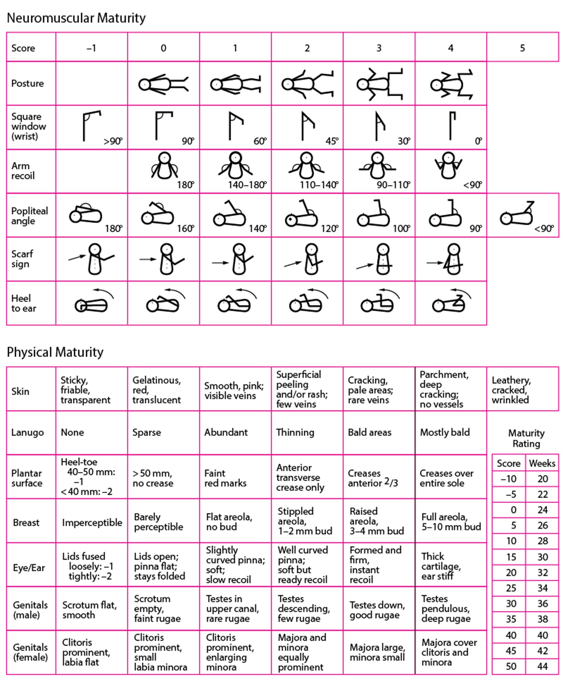

# Ballard Score Calculator



An interactive React + Vite application for estimating neonatal gestational age using the Ballard Score. Clinicians and trainees can quickly document neuromuscular and physical maturity findings, see subtotal updates, and translate the total score into an estimated gestational age, measured in weeks.

## Features

- Guided scoring for neuromuscular and physical maturity domains with contextual tooltips
- Sex-specific genital criteria that adapt the physical maturity assessment
- Automatic gestational age interpolation with clear subtotals and copy-ready summaries
- Clean, responsive layout designed for bedside or desktop use

## Clinical Reference

Scoring guidance aligns with the New Ballard Score framework for gestational age assessment as described by [MSD Manuals Professional Edition - Gestational Age](https://www.msdmanuals.com/professional/pediatrics/perinatal-problems/gestational-age).

## Getting Started

**Prerequisites:** Node.js 18+

```bash
npm install
npm run dev
```

## Production Build

```bash
npm run build
npm run preview
```

## Deploying to GitHub Pages

- Push the project to a GitHub repository and ensure the default branch is `master`.
- Open the repository in GitHub and enable Pages under **Settings → Pages**, selecting **GitHub Actions** as the source.
- The included workflow will build on every push to `master` and publish the static `dist` output automatically.
- By default the workflow sets `VITE_APP_BASE_PATH` to `/${repository-name}/`; adjust by defining a different value in the workflow or repository/environment secrets if you are deploying to a custom domain or user/organization site.
